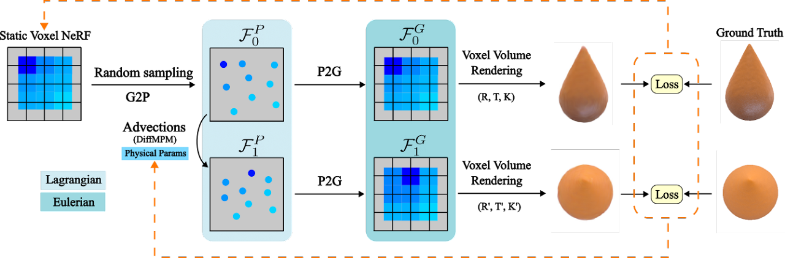
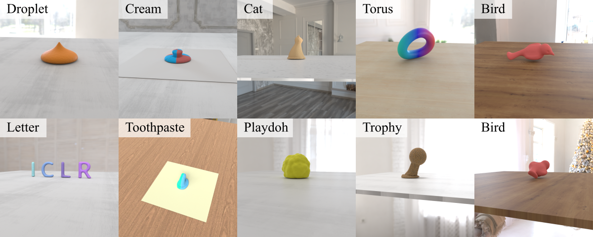

# PAC-NeRF: Physics Augmented Continuum Neural Radiance Fields for Geometry-Agnostic System Identification (ICLR 2023 Notable-Top-25%)
### [[OpenReview]](https://openreview.net/forum?id=tVkrbkz42vc)[[Demo]](https://xuan-li.github.io/PAC-NeRF)[[Dataset]](https://ucla.box.com/s/039jwttn9ibac73h3kit5vsuiepy7j4y)

PAC-NeRF (Physics Augmented Continuum Neural Radiance Fields) is a  novel approach to estimating both the unknown geometry and physical parameters of highly dynamic objects from multi-view videos. We design PAC-NeRF to only ever produce physically plausible states by enforcing the neural radiance field to follow the conservation laws of continuum mechanics.

For this, we design a hybrid Eulerian-Lagrangian representation of the neural radiance field, i.e., we use the Eulerian grid representation for NeRF density and color fields, while advecting the neural radiance fields via Lagrangian particles. This hybrid Eulerian-Lagrangian representation seamlessly blends efficient neural rendering with the material point method (MPM) for robust differentiable physics simulation. 



## Dependencies
Install CUDA 11.6 (nvcc required)
```
git clone https://github.com/xuan-li/PAC-NeRF.git
cd PAC-NeRF
conda create -n pacnerf python=3.9
conda activate pacnerf
conda install pytorch torchvision torchaudio pytorch-cuda=11.6 -c pytorch -c nvidia
pip install -r requirements.txt
```

## Download Dataset
Download `data.zip` from this [UCLA Box](https://ucla.box.com/s/039jwttn9ibac73h3kit5vsuiepy7j4y). Unzip it to the root dir.

The structure should look like the following:
```
├── data 
│   ├── torus
│   ├── bird 
│   ├── ...
```



## Download Pre-trained [BackgroundMatting](https://github.com/PeterL1n/BackgroundMattingV2) Model Weights
Create `checkpoint` folder under the root dir. Download `pytorch_resnet101.pth` from the same [drive](https://ucla.box.com/s/039jwttn9ibac73h3kit5vsuiepy7j4y) to `checkpoint` folder.

The structure should look like the following:
```
├── checkpoint 
│   ├── pytorch_resnet101.pth
```

## Infer Physical Parameters
Here are instructions to run `torus` example:

```
python train.py --config=configs/torus.py
```
The segmented images will be saved to `data/torus/data`, starting with `m_`.

The particle sequence (ply files) generated by Taichi MPM simulator will be output to `checkpoint/torus/simulation`.

You can generate a video from the first camera using:
```
python test.py --config=configs/torus.py --num-frame=14 --cam-id=0
```
`video_0.rgb.mp4` will be generated under `checkpoint/torus`:

<div align="center"></div>

## (Optional) Groundtruth Particle Data
You can download and view the groundtruth particle sequence `simulation_data.zip` from the same [drive](https://ucla.box.com/s/039jwttn9ibac73h3kit5vsuiepy7j4y).


## Star History

[](https://star-history.com/#xuan-li/PAC-NeRF&Date)
